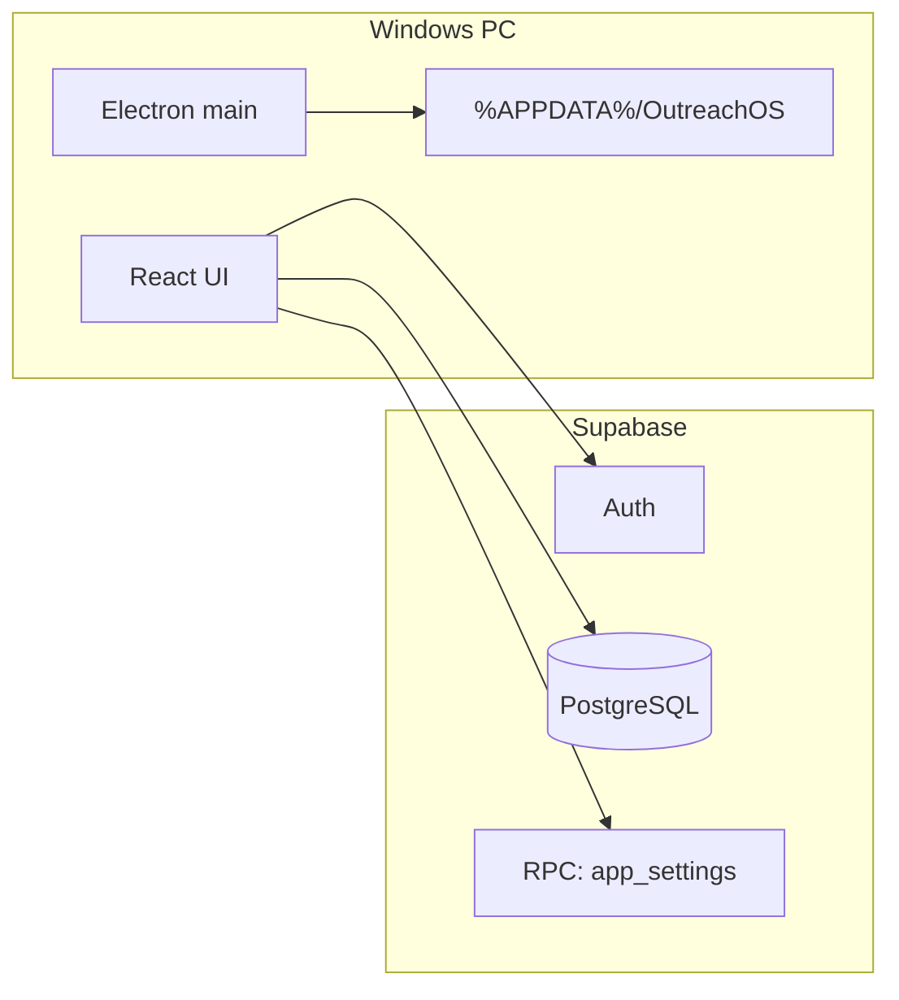

# OutreachOS — Developer setup guide

Complete onboarding for a new developer setting up OutreachOS for **your company** (Supabase project, local dev, Windows installer, team rollout).

**Time:** ~45–60 minutes for first-time setup.

---

## What you are building

| Layer | Technology |
|-------|------------|
| Desktop shell | Electron 41 |
| UI | React 19 + Vite 8 + Tailwind |
| State | Zustand |
| Backend | Supabase (PostgreSQL + Auth + RLS) |
| Routing | React Router (`HashRouter` for packaged `file://` loads) |

All sales users share **one Supabase project**. Each person has their own login. CRM data (businesses, activities, templates) lives in Postgres, not on individual PCs.

---

## Architecture



**Config flow**

1. **Build time** — `.env` → Vite embeds `VITE_SUPABASE_URL` and `VITE_SUPABASE_ANON_KEY` into the installer (bootstrap only).
2. **After login** — Optional overrides from `app_settings` in the database (admin password required to edit in Settings).
3. **Never in the app** — Supabase **service role** key.

---

## Prerequisites

| Tool | Version |
|------|---------|
| **Node.js** | 20 LTS or newer |
| **npm** | Comes with Node |
| **Git** | Any recent version |
| **Windows** | 10/11 (for building/running the desktop app; dev on Mac/Linux is possible for UI only, installer targets Windows) |
| **Supabase account** | [supabase.com](https://supabase.com) — free tier is enough to start |

Optional: [Supabase CLI](https://supabase.com/docs/guides/cli) for local Postgres (not required; this project uses hosted Supabase + SQL Editor).

---

## 1. Get the code

```bash
git clone <your-company-repo-url>
cd outreachos    # or CRM/outreachos depending on repo layout
npm install
```

**Do not commit:** `.env`, `release/`, `release-build/`, `node_modules/`, `dist/`. These are in `.gitignore`.

---

## 2. Create a Supabase project (one per company)

1. [Supabase Dashboard](https://supabase.com/dashboard) → **New project**.
2. Choose organization, name (e.g. `outreachos-prod`), region, database password.
3. Wait until the project is **Active**.

**Save these** (Project Settings → **API**):

| Setting | Use in OutreachOS |
|---------|-------------------|
| **Project URL** | `VITE_SUPABASE_URL` |
| **anon / publishable key** | `VITE_SUPABASE_ANON_KEY` |
| **service_role key** | **Never** put in the app — dashboard/SQL only |

---

## 3. Configure Supabase Auth

Required so register/login works in the desktop app.

1. Dashboard → **Authentication** → **Providers** → **Email**.
2. Enable **Email**.
3. For internal team desktop use, turn **OFF** “Confirm email” so sign-up logs in immediately.
4. Save.

**Optional:** Authentication → **Users** — manage accounts after people register.

**Password length:** Supabase default minimum is usually 6; the app allows 6+ characters on register.

---

## 4. Database setup

The app does **not** create tables automatically. Run SQL in the Supabase **SQL Editor**.

### Path A — New project (recommended)

1. Open `supabase/schema.sql` in this repo.
2. Copy the **entire file** into SQL Editor → **Run**.
3. Confirm success and seed counts at the bottom (`services` ≈ 4, `email_templates` ≈ 6, `call_templates` ≈ 2).
4. Run the admin-settings migration (not in `schema.sql`):

   `supabase/migrations/20260523_app_settings.sql`

5. Set admin password (Section 5 below).

`schema.sql` already includes: `outreach_channel`, `call_templates`, activity template columns, `is_primary` on decision makers, RLS, indexes, seeds.

### Path B — Existing project / incremental updates

If the database was created earlier, run **only missing** migration files in order:

| File | Purpose |
|------|---------|
| `20260519_lead_processing.sql` | `is_primary` on `decision_makers` |
| `20260520_outreach_channel.sql` | `outreach_channel` on `activities` |
| `20260521_call_templates.sql` | `call_templates` table + RLS |
| `20260522_activity_templates.sql` | `template_id`, `call_template_id`, `call_script_id` on `activities` |
| `20260523_app_settings.sql` | Admin password + optional DB connection overrides |

Each file is idempotent (`IF NOT EXISTS` / `CREATE OR REPLACE`) where possible.

### Tables overview

| Table | Purpose |
|-------|---------|
| `businesses` | Leads / accounts, pipeline status |
| `decision_makers` | Contacts per business |
| `services` | Offerings (seeded) |
| `business_services` | Business ↔ service links |
| `activities` | Calls, emails, notes, follow-ups |
| `email_templates` | Email scripts |
| `call_templates` | Call scripts (JSON `scripts` array) |
| `reminder_settings` | Per-user notification prefs |
| `app_settings` | Singleton: admin password hash, optional URL/key override |

### Row Level Security

All CRM tables use **authenticated full access** — any logged-in user can read/write. Suitable for a trusted internal team. See `supabase/verify-rls.md` for testing notes.

**Destructive reset (dev only):** see `docs/PHASE3_DATABASE.md` → “Re-run / reset”.

---

## 5. Admin password (required for connection settings UI)

After `20260523_app_settings.sql`, set a password in SQL Editor:

```sql
UPDATE public.app_settings
SET admin_password_hash = crypt('YourSecureAdminPassword', gen_salt('bf'))
WHERE id = 1;
```

Share this password only with admins. Team members use **Settings → Database connection (admin)** to unlock view/edit of optional Supabase URL overrides stored in the database.

**Change password later:**

```sql
UPDATE public.app_settings
SET admin_password_hash = crypt('NewPassword', gen_salt('bf'))
WHERE id = 1;
```

**Optional — store connection in DB** (overrides baked installer after login):

```sql
UPDATE public.app_settings
SET
  supabase_url = 'https://YOUR_PROJECT.supabase.co',
  supabase_anon_key = 'YOUR_ANON_KEY'
WHERE id = 1;
```

Leave both NULL to use only build-time `.env` credentials.

---

## 6. Environment variables (local dev)

```bash
cp .env.example .env
```

Edit `.env`:

```env
VITE_SUPABASE_URL=https://xxxxxxxx.supabase.co
VITE_SUPABASE_ANON_KEY=eyJhbGciOiJIUzI1NiIsInR5cCI6IkpXVCJ9...
```

- Prefix `VITE_` is required — Vite exposes only these to the client bundle.
- Restart `npm run dev` after changing `.env`.

---

## 7. Run locally

```bash
npm run dev
```

This starts:

1. **Vite** on `http://127.0.0.1:5173` (strict port)
2. **Electron** loading that URL with hot reload

**First run checklist**

1. Register a new account (or sign in).
2. You should land on the **Dashboard**.
3. Close the app completely → reopen → still logged in (session in `%APPDATA%/OutreachOS/`).
4. **Settings → Database** → **Check database** — all checks green.
5. Add a test business under **Businesses**.

**Other scripts**

| Command | Purpose |
|---------|---------|
| `npm run build` | Production React build → `dist/` |
| `npm run preview` | Preview Vite build in browser (no Electron) |
| `npm run lint` | ESLint |
| `npm run electron:build` | Installer → `release/` |
| `npm run electron:build:fresh` | Installer → `release-build/` (if `release/` is file-locked) |

---

## 8. Verify setup (developer checklist)

- [ ] `npm install` completes without errors
- [ ] `.env` has valid URL + anon key
- [ ] `schema.sql` + `20260523_app_settings.sql` applied
- [ ] Admin password SQL executed
- [ ] Email auth enabled, confirm-email off (if desired)
- [ ] `npm run dev` opens Electron window
- [ ] Register → Dashboard works
- [ ] Settings → Database → Check database passes
- [ ] Can create business + decision maker + log activity
- [ ] Email templates and call templates pages load

---

## 9. Build the Windows installer

1. Ensure `.env` has production Supabase credentials (baked into the installer).
2. Close any running OutreachOS / Electron instances.
3. Build:

```bash
npm run electron:build
```

Output: `release/OutreachOS Setup 0.1.0.exe`

**If build fails** with `app.asar` / “file is being used by another process”:

- Quit OutreachOS and close Explorer windows inside `release/`.
- Delete `release/win-unpacked` if possible, or reboot.
- Use: `npm run electron:build:fresh` → output in `release-build/`.

**Optional branding:** add `build/icon.ico` for a custom installer icon (build works without it).

**What gets shipped to the team:** only the `.exe` installer — not `win-unpacked/`, not `release/` folder.

Bundled in the installer: `resources/INSTALL.md` (end-user guide).

---

## 10. Roll out to your team

See **[INSTALL.md](./INSTALL.md)** (end-user / IT admin).

Summary:

1. Send `OutreachOS Setup 0.1.0.exe`.
2. Each user installs and signs in with their own email.
3. Each user enables **Settings → Startup** on their PC if they want launch on boot.
4. Admins use **Settings → Database connection (admin)** only when changing project URL/key in the database.

---

## Project structure

```
outreachos/
├── electron/              # Main process (IPC, auth storage, auto-launch, reminders)
│   ├── main.cjs
│   ├── preload.cjs
│   ├── authStorage.cjs
│   ├── autoLaunch.cjs
│   └── userPrefs.cjs
├── src/
│   ├── pages/             # Route screens (Dashboard, Businesses, Settings, …)
│   ├── components/        # UI by feature (businesses, activities, settings, …)
│   ├── stores/            # Zustand (auth, preferences, activities, …)
│   ├── lib/               # API clients, Supabase, metrics, dbCheck
│   ├── routes/AppRouter.jsx
│   └── App.jsx            # Bootstrap config → auth → router
├── supabase/
│   ├── schema.sql         # Full schema + seeds (run once on new project)
│   └── migrations/        # Incremental SQL (dated filenames)
├── docs/                  # Documentation (this file, INSTALL, phase guides)
├── .env.example
└── package.json
```

### Main routes

| Path | Page |
|------|------|
| `/` | Dashboard (pipeline, metrics) |
| `/work-queue` | Follow-up queue |
| `/businesses` | Leads CRUD + outreach playbook |
| `/decision-makers` | Contacts |
| `/activities` | Activity log |
| `/email-templates` | Email templates |
| `/call-templates` | Call script templates |
| `/analytics` | Reports |
| `/settings` | Theme, timing, DB health, admin connection, startup |

### Key source files

| Area | Files |
|------|-------|
| Auth | `src/stores/authStore.js`, `electron/authStorage.cjs` |
| Supabase client | `src/lib/supabase.js`, `src/lib/runtimeConfig.js` |
| Admin DB settings | `src/lib/appSettingsApi.js`, `supabase/migrations/20260523_app_settings.sql` |
| Businesses API | `src/lib/businessApi.js` |
| Activities | `src/lib/activityApi.js` |
| DB verification | `src/lib/dbCheck.js`, `src/components/settings/DatabaseHealthCard.jsx` |
| Reminders | `src/hooks/useReminderScheduler.js`, `electron/main.cjs` (notifications) |

---

## Domain concepts (for new devs)

- **Business** — A lead/company in the pipeline (`new` → `closed_won` / `closed_lost`).
- **Decision maker** — Contact at a business; one can be `is_primary`.
- **Activity** — Logged touchpoint (call, email, note, …) with optional `outreach_channel` (`phone` / `email`).
- **Work queue** — Businesses/decision makers due for follow-up based on `next_followup_at` and outreach timing settings.
- **Templates** — Email (`email_templates`) and call scripts (`call_templates.scripts` JSON array).
- **Per-contact leads** — Outreach playbook runs per decision maker, not only per business.

---

## Security rules

| Do | Don't |
|----|-------|
| Use **anon** key in `.env` and installer | Commit `.env` or paste **service_role** in the app |
| Store admin password as **bcrypt hash** in `app_settings` | Store admin password in plain text in Supabase |
| Share installer `.exe` with team | Commit `release/` or `*.exe` to git |
| Rotate anon key in Supabase if leaked | Assume anon key is secret from determined users (client apps expose it) |

The anon key is embedded in the desktop bundle by design so the app can reach Supabase before login. RLS + Auth protect data; optional `app_settings` overrides are admin-gated.

---

## Adding a new database migration

1. Create `supabase/migrations/YYYYMMDD_description.sql`.
2. Use `IF NOT EXISTS` / `CREATE OR REPLACE` when possible.
3. Run in Supabase SQL Editor on staging, then production.
4. If the change must be detected in-app, extend `src/lib/dbCheck.js` and/or `src/lib/migrationHints.js`.
5. Update this guide’s migration table and `docs/INSTALL.md`.
6. For greenfield installs, consider folding the change into `schema.sql` later.

---

## Troubleshooting

| Problem | What to try |
|---------|-------------|
| `npm run dev` — port in use | Stop other Vite on 5173 or change `vite.config.js` `server.port` |
| Login fails / network error | Check URL in `.env`, project not paused, internet |
| “Missing table” in app | Run `schema.sql` + migrations; Settings → Database |
| `outreach_channel` / `template_id` errors | Run migrations `20260520`, `20260522` |
| Admin connection locked | Run `20260523` + admin password SQL |
| Electron build file lock | Close app; `electron:build:fresh`; reboot |
| Auto-launch not working on a PC | User must enable Settings → Startup once per machine |
| Session lost after reinstall | Normal — user signs in again; data is in Supabase |
| RLS policy errors | User must be logged in; check policies in `schema.sql` |

---

## Documentation index

| Document | Audience |
|----------|----------|
| **[DEVELOPER_SETUP.md](./DEVELOPER_SETUP.md)** (this file) | New developers — full company setup |
| **[INSTALL.md](./INSTALL.md)** | IT / team — install `.exe`, migrations, admin password |
| **[PHASE3_DATABASE.md](./PHASE3_DATABASE.md)** | Database deep dive + reset SQL |
| **[PHASE2_SUPABASE_AUTH.md](./PHASE2_SUPABASE_AUTH.md)** | Auth provider settings |
| **[PHASE11_DISTRIBUTION.md](./PHASE11_DISTRIBUTION.md)** | Packaging notes |
| **[README.md](./README.md)** | Phase docs index |
| **[../PHASES.md](../PHASES.md)** | Original 11-phase build plan |
| **[../PROGRESS.md](../PROGRESS.md)** | Feature completion status |
| **[../README.md](../README.md)** | Repo quick start |

---

## Quick reference — one-page setup

```bash
# 1. Code
git clone <repo> && cd outreachos && npm install

# 2. Env
cp .env.example .env   # fill VITE_SUPABASE_URL + VITE_SUPABASE_ANON_KEY

# 3. Supabase SQL Editor: run schema.sql, then 20260523_app_settings.sql
# 4. Supabase SQL Editor: set admin_password_hash (crypt + gen_salt)
# 5. Supabase Dashboard: Auth → Email on, confirm email off

# 6. Dev
npm run dev

# 7. Ship
npm run electron:build   # → release/OutreachOS Setup 0.1.0.exe
```

For questions about a specific feature area, open the matching `docs/PHASE*.md` file for test checklists and implementation notes.
